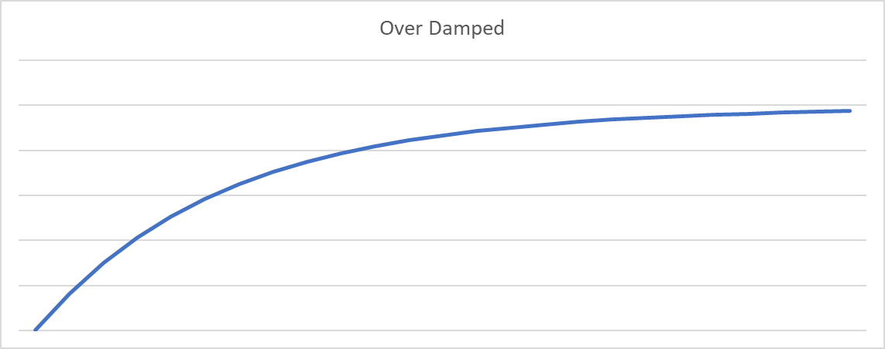
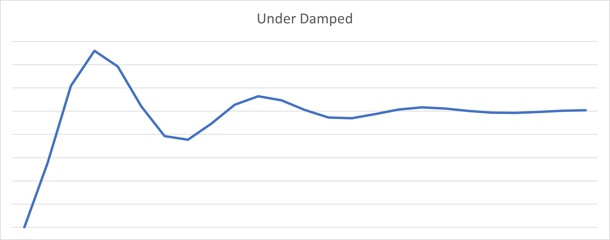

[comment]: <> (https://codecogs.com/latex/eqneditor.php)

# Personal Lines Functions

## Loss Development Model - Damped Harmonic Oscillator - Cummulative Development

The claims process begins with the occurrence of a claim event.  When the event occurs the claimant is displaced from his equilibrium.  To the extent that the claimant is willing and able to make a claim, he will return to equilibrium.  To the extent that the claims organization is willing or able to pay the claim, via contract language and processing, the company will dampen the return to equilibrium.  This is a damped harmonic oscillator, represented as follows:

Where  is the loss at time t.  is the Ultimate loss.   and  are parameters.  

This can be solved 3 ways.  When we group claim types and analyze them over time, these are the paterns that emerge.  
### Over Damped: 

Where a and b are function of  and .  Bodily injury claims develop this way.  

 

### Under Damped: 

Underinsured and uninsured motorist coverage with the low frequency and high severity claim types behave this way.  

### Critically Damped: 

Comprehensive and Collision coverage, with the salvage and subrogation behave this way.

 
 
 
 

## Amount of insurance model factors: 

## Deductibles by amount of insurance factors: 

 
 
 
 

## Increased Limits Model
### Occurance Limit = Claim Limit ex 500/500 or 500CSL:

### Occurance Limit = 2xClaim Limit ex 250/500:

### Occurance Limit = 3xClaim Limit ex 100/300:

 
 
 
 

## Homeowners Catastrophe Model (aggregate)
### Mean of aggregate distribution = mean(f)*mean(s)

#### Assume: 
#### The frequency follows a negative binomial distribution.
#### The severity follows a weibull distribution - behaves like a fractal...
### Variance of aggregate distribution:

#### Where:  
#### E(S) = Mean of Severity distribution.
#### E(S^2) = Second Moment of the Severity Distribution about the origin.
#### n = number of events 
#### r = number of successes.

 
 
 
 

## Price implementation model
#### Many times we can only move toward the proposed from current due to disruption.
#### The following optimizes it and assumes that the rates will be in effect for a year. 

 

Where P is the Modeled Factor, C is the Current Factor and we are solving for .  

 
 
 
 
